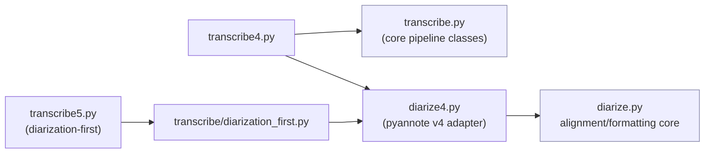
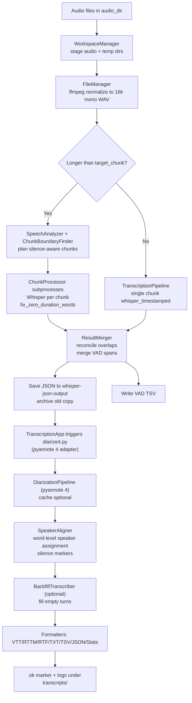
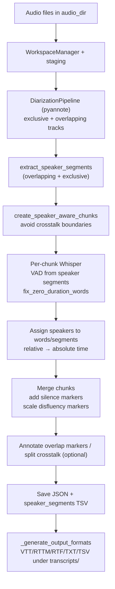

# swhisper Architecture

This project wraps Whisper transcription and pyannote diarization into two main pipelines: the standard “transcribe → diarize” flow and a diarization-first flow. The code is modular so staging, chunking, diarization, alignment, and formatting can evolve independently.

## Repository Structure
- `transcribe/` – chunking, staging, Whisper pipelines, merging, diarization-first path.
- `diarize/` – pyannote interfaces, alignment, segmentation, backfill, output formatters, SenseVoice hooks.

## Entry Points
- `transcribe4.py` – current default for the standard flow; Whisper chunking followed by `diarize4.py` (pyannote 4 community/precision models).
- `transcribe.py` – legacy standard flow that uses `diarize.py` (pyannote 3.1 defaults).
- `transcribe5.py` – diarization-first mode; uses `transcribe/diarization_first.py`.
- `diarize4.py` – pyannote 4 diarization entry; delegates to `diarize.py` logic with v4 models/tokens resolved.
- `diarize.py` – legacy diarization entry; aligns Whisper JSON to speakers, adds markers/backfill, and formats outputs.

### Version Layering

## Shared Configuration & Paths
- `path_settings.py` loads `.swhisper.env` overrides for audio/temp roots and optional strict model path.
- `TranscriptionConfig` + `WhisperSettings` (chunk sizes, overlap, device/model, VAD backend, beam params, confidence flags). Defaults: 16 kHz mono WAV, 180 s chunks, Silero VAD.
- `DiarizationConfig` (pyannote model ids, device, speaker count hints, clustering thresholds, silence handling, backfill toggles, cache dirs, output folders, SenseVoice options).

## Transcription Pipeline (Standard Flow: transcribe4.py → diarize4.py)
### Responsibilities
- Discover, stage, chunk, and transcribe audio; hand off to diarization for speaker attribution; emit machine-friendly and human-friendly transcripts.

### Key Components
- Workspace & staging: `WorkspaceManager`, `FileManager` (ffmpeg to 16k mono), `CheckpointManager`.
- Chunk planning: `SpeechAnalyzer`, `ChunkBoundaryFinder`.
- Execution & merge: `TranscriptionPipeline` (orchestrates), `ChunkProcessor`/`TranscriptionWorker` (subprocess Whisper), `ResultMerger` (overlap reconciliation), `resource_manager` for cleanup.
- Diarization handoff: `TranscriptionApp._run_diarization_pipeline` → `diarize4.py` → `DiarizationPipeline` (pyannote 4).
- Alignment & formatting: `SpeakerAligner`, `BackfillTranscriber` (optional), formatters in `diarize/output.py`.

### Data Artifacts Produced
- `whisper-json-output/<basename>.json` (archived on overwrite), `<basename>_vad.tsv`.
- Transcript outputs under `transcripts/{vtt,rttm,rtf,txt,tsv,json,stats,logs}`, per-file logs, `.ok` completion marker, optional silence-gap logs.

### Flow Summary
1) Workspace & staging – set up temp workspace, verify model cache, stage/convert audio, set checkpoint root.
2) Chunk planning – silence-aware boundaries for long files; short files skip chunking.
3) Chunk transcription – subprocess Whisper per chunk with offset correction and zero-duration word fix.
4) Merging – reconcile overlaps, merge VAD spans, save JSON + VAD TSV, archive prior JSONs.
5) Diarization – run pyannote via `diarize4.py` (community/precision v4 models per `DiarizationConfig`), optional cache.
6) Alignment & enrichment – speaker labels, smoothing, silence markers, optional backfill (SenseVoice optional).
7) Outputs – VTT/RTTM/RTF/TXT/TSV/JSON/stats, logs, `.ok` marker.

#### Guardrails
- Invariants: ChunkProcessor must run Whisper in subprocesses to free GPU/MPS memory; ResultMerger expects chunk outputs with timestamps already offset to absolute time; checkpoints stay keyed to the audio basename.
- Unsafe to change casually: Chunk boundaries must remain monotonic (with overlap) and align to planned silences; Backfill must not reorder global JSON segments; VAD TSV should mirror merged speech_activity spans.
- Module boundaries: `TranscriptionPipeline` orchestrates chunk execution/merge; speech preview + boundary finding live in `SpeechAnalyzer`/`ChunkBoundaryFinder`; diarization/alignment/formatting live in `diarize/`.

### Mermaid: Standard Flow

## Diarization Pipeline (diarize4.py / diarize.py)
### Responsibilities
- Run pyannote diarization, cache results, align Whisper JSON to speakers, add markers/backfill, and render transcript formats.

### Key Components
- Pyannote loader/config: `DiarizationPipeline`, `DiarizationConfig`, `DiarizationCache`.
- Alignment/post-processing: `SpeakerAligner`, `WordProcessor`, `SilenceMarkerProcessor`, `BackfillTranscriber`/`BackfillCache`, optional SenseVoice enrichment.
- Output: `VTTFormatter`, `RTTMFormatter` (standard + detailed), `RTFFormatter`, `TXTFormatter`, `TSVFormatter`, `JSONFormatter`, `StatsExporter`.

### Data Artifacts Produced
- Pyannote segment TSVs (overlapping/exclusive), raw RTTM reference, aligned transcripts under `transcripts/`, logs (per-file + optional silence-gap), `.ok` marker.

### Flow Summary
1) Load Whisper JSON (apply timestamp offset if configured); hydrate cloud files.
2) Run or load cached pyannote diarization (standard + exclusive if available).
3) Save pyannote segment TSVs and raw RTTM; analyze diarization stats.
4) Align words/segments to speakers, smooth/silence-mark, annotate disfluencies, optional backfill for empty turns.
5) Export transcripts (VTT/RTTM/RTF/TXT/TSV/JSON/stats) and write `.ok` marker.

#### Guardrails
- Invariants: SpeakerAligner assumes diarization spans are non-overlapping for primary labels; word smoothing assumes each word has a speaker; silence marker insertion expects chronological segments with gaps intact.
- Unsafe to change casually: Backfill must not alter segment order or drop speaker tags; diarization cache keys must include model id and speaker count hints; RTTM/TSV exports must not filter non-silence words.
- Module boundaries: Alignment, backfill, and formatting live in `diarize/`; transcription chunking/VAD decisions stay in `transcribe/`; shared device/memory helpers are cross-cutting but do not own alignment.

## Diarization-First Pipeline (transcribe5.py)
### Responsibilities
- Perform diarization before transcription, use speaker segments as VAD/chunk boundaries, and emit transcripts with speaker labels without the post-transcription diarization step.

### Key Components
- Diarization: `DiarizationPipeline` (pyannote 4) invoked from `transcribe/diarization_first.py`.
- Chunking/VAD: `extract_speaker_segments`, `create_speaker_aware_chunks`, `convert_segments_to_vad_format` in `transcribe/speaker_chunking.py`.
- Transcription/merge: chunk-level Whisper with speaker-segment VAD, merge to absolute time, silence/disfluency handling, optional overlap annotations.
- Formatting: `_generate_output_formats` reuses `diarize/output.py` formatters; speaker segment TSV export.

### Data Artifacts Produced
- Per-file JSON with speaker labels, speaker segment TSV, transcripts under `transcripts/{vtt,rttm,rtf,txt,tsv}`.

### Flow Summary
1) Run pyannote to get exclusive + overlapping tracks.
2) Build speaker segments; create speaker-aware chunks (avoid crosstalk cuts).
3) Transcribe each chunk with speaker-VAD; assign speakers to words/segments.
4) Merge chunks, add silence markers, scale disfluency markers, optionally annotate overlaps/split crosstalk.
5) Save JSON + speaker TSV; emit transcripts via shared formatters.

#### Guardrails
- Invariants: Speaker-aware chunking cuts on diarization turns (or enforced max duration) and avoids crosstalk splits when overlap data exists; per-chunk VAD for Whisper is chunk-relative; post-merge silence markers assume word lists are in absolute time.
- Unsafe to change casually: Do not drop overlapping diarization when annotating disfluency overlap; speaker segment TSV stays flat with absolute timestamps; merging must preserve chunk order.
- Module boundaries: `transcribe/diarization_first.py` owns diarization-first orchestration/merge; speaker segment extraction/chunk creation stay in `transcribe/speaker_chunking.py`; final formatting uses `diarize/output.py`, but alignment logic remains in the transcribe-side pipeline.

### Mermaid: Diarization-First Flow

## Module Anchors (where things live)
- BackfillTranscriber / BackfillCache / silence marker helpers: `diarize/utils.py`
- SenseVoice integration: `diarize/sensevoice_provider.py` (config toggles in `diarize/config.py`)
- Speaker-aware chunking utilities: `transcribe/speaker_chunking.py`
- VAD span merge + overlap reconciliation: `ResultMerger` in `transcribe/transcription.py`
- Diarization caching (RTTM): `diarize/diarization_cache.py`

## Supporting Utilities
- **Memory & signals** – `ResourceManager`/`DeviceManager` clear GPU/MPS/CPU caches; signal handlers preserve checkpoints on exit. Subprocess memory is sampled for reporting.
- **Checkpointing** – `CheckpointManager` saves after each chunk; resume probes multiple roots (workspace temp vs output) before restarting work.
- **Caching** – `DiarizationCache` stores pyannote outputs keyed by audio hash + params; `BackfillCache` (in utils) avoids redoing targeted re-transcription.
- **Path/layout conventions** – Audio defaults to `audio/`; transcription JSON to `whisper-json-output/`; diarization outputs under `transcripts/{vtt,rttm,rtf,txt,tsv,json,stats,logs}` in the same audio root; temp workspace under `SWHISPER_TEMP_DIR` or system temp (`swhisper_workspace`).
